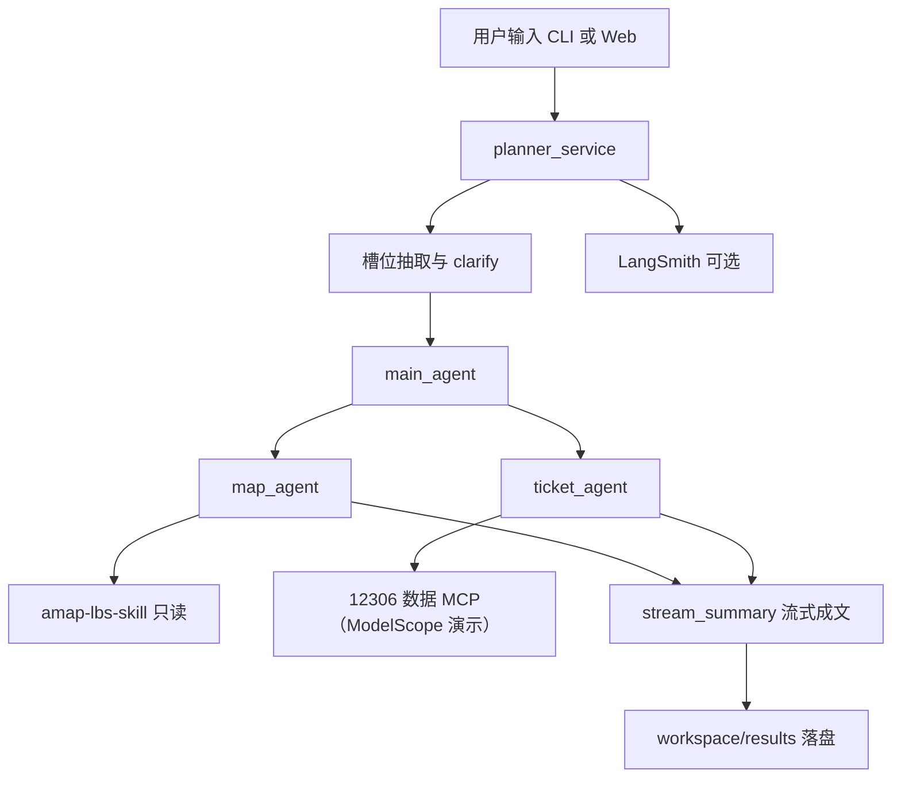

# 旅游规划多智能体


这个项目用旅行规划练多智能体编排里三件事：外部工具不可靠时怎么降级、成文阶段怎么拦住编造、子智能体执行时怎么挡住改文件和读密钥。一句自然语言需求，产出景点、路线地图和车票建议。

可交互架构图：[docs/travel-planner-runtime.html](docs/travel-planner-runtime.html)。说明见 [ARCHITECTURE.md](ARCHITECTURE.md)。评测见 [EVALS.md](EVALS.md)。

支持两种入口，共用同一套规划核心：

| 入口 | 命令 | 说明 |
|------|------|------|
| Web | `python -m uvicorn server:app --reload --reload-exclude workspace --host 127.0.0.1 --port 8000` | FastAPI + Vue3，SSE 流式进度 |
| CLI | `python app.py "你的需求"` | 控制台交互，支持澄清补槽 |

---

## 功能一览

- **自然语言理解**：抽取出发地、目的地、日期、天数、预算、偏好、节奏等槽位
- **人机确认（HITL）**：出发地 / 目的地 / 日期缺失时弹出确认卡；软字段可预填默认值
- **地图子智能体**：挂载本地高德 Skill，推荐景点、规划路线、生成地图 HTML
- **车票子智能体**：接入提供 12306 数据的公开 MCP（ModelScope 演示端点）查车次与票价；不可用时降级，**禁止编造票务**
- **流式汇总**：按固定六章节输出 Markdown；落盘前校验章节，无可靠票务时禁止车次号，失败重试一次，仍失败则降级
- **用量**：`final.timings` 含 `prompt_tokens`、`completion_tokens`、`cost_usd`（单价见 `.env.example`，未设置时成本为 0）
- **产物落盘**：方案写入 `workspace/results/`，地图写入 `workspace/results/maps/{plan_id}.html`
- **可选 LangSmith**：过程可视化追踪

---

## 架构



| 组件 | 职责 |
|------|------|
| `main_agent` | 按已确认槽位调度 map / ticket（模型：DeepSeek `deepseek-flash`）。只发 task，不写最终长文 |
| HITL | critical 槽位齐全才继续；soft 槽位可默认 |
| `map_agent` | 景点 / 路线 / 地图。工具面只有只读高德 Skill 和该目录下的 shell |
| `ticket_agent` | 车次 / 票价。工具面只有 12306 MCP；同城或明确自驾等不挂载 |
| `stream_summary` | 编排层一次无工具调用，落盘前过闸门 |

子智能体分开挂，是为了工具面隔离，不是为了多一段人设。见 [ADR-4](docs/adr/0004-subagent-is-tool-surface.md)。
| 文件系统 | 智能体仅能访问 `/workspace/results`、`/workspace/config`、`/workspace/skills` |

---

## 快速开始

### 环境要求

- Python **3.11+**（推荐 Conda）
- Node.js **18+**（高德 Skill 脚本依赖）
- DeepSeek API Key、高德 Web 服务 Key
- 前端脚本在 `frontend/vendor/`，打开首页不依赖 unpkg

### 1. 克隆并安装 Python 依赖

```bash
git clone <你的仓库地址>
cd 旅行规划多智能体

conda create -n travel-planner python=3.11 -y
conda activate travel-planner
pip install -r requirements.txt
pytest -q -m "not integration"
```

先跑上面的 pytest，确认当前环境能过单元测试，再配密钥。

### 2. 安装高德 Skill 依赖

```bash
cd amap-lbs-skill
npm install
cd ..
```

### 3. 配置密钥

```bash
# Windows
copy .env.example .env

# macOS / Linux
cp .env.example .env
```

编辑 `.env`（**切勿提交**）：

| 服务 | 申请入口 | 环境变量 |
|------|----------|----------|
| DeepSeek | https://api.deepseek.com | `OPENAI_API_KEY`、`OPENAI_BASE_URL=https://api.deepseek.com`（模型 `deepseek-flash`） |
| 高德 Web 服务 | https://lbs.amap.com/api/webservice/create-project-and-key | `AMAP_WEBSERVICE_KEY` |
| LangSmith（可选） | https://smith.langchain.com | `LANGSMITH_TRACING`、`LANGSMITH_API_KEY`、`LANGSMITH_PROJECT=travel-planner`；自动链接失败时再填 `LANGSMITH_ORG_ID` |

同文件里还有：`CORS_ORIGINS`（默认同源 `127.0.0.1:8000`）、`MCP_12306_URL`（不填则用 ModelScope 演示端点）、`DISPATCH_TIMEOUT_SECONDS`（默认 360，只限制不需要地图时的主智能体）、`PLAN_RATE_PER_MINUTE`（默认每分钟 8 次）、`PLAN_API_KEY`（设置后 `POST /api/plan` 要求请求头 `X-API-Key`）、`TOKEN_USD_PER_M_IN` / `TOKEN_USD_PER_M_OUT`（每百万 token 美元单价，用于 `cost_usd`）。

也可把高德 Key 写入 `amap-lbs-skill/config.json`（由 `config.example.json` 复制），该文件已被 gitignore。`MCP_12306_URL` 的默认地址在 `planner/ticket_agent.py`。

### 4. 启动

**Web（推荐）：**

```bash
python -m uvicorn server:app --reload --reload-exclude workspace --host 127.0.0.1 --port 8000
```

浏览器打开：http://127.0.0.1:8000/

**CLI：**

```bash
python app.py "这周六从新乡坐高铁去郑州一日游，预算 500，少折腾"
python app.py   # 交互输入
```

规划结果示例路径：

- `workspace/results/旅游规划-YYYY-MM-DD-HHMMSS.md`
- `workspace/results/maps/{plan_id}.html`（用户未声明不要地图时必须生成）

---

## 端到端验收场景

Web 首页 chips 与下列场景一一对应：点「跨城高铁」「租电车自驾」「MCP 降级」「修订方案」会填入需求并展示一份写好的详细示例；点「开始规划」才真实查询。HITL 只填入缺信息的短句。出发地和出行方式写在用户话里。

1. **跨城高铁（并行）**：`这周六从新乡坐高铁去郑州一日游，预算 500，少折腾` — 看 map 与 ticket 同超步发出。
2. **省内租电车自驾**：`下周从新乡租电车自驾去洛阳两天，轻松点，别安排开封和宝泉` — ticket `skipped`，方案考虑续航/充电。
3. **HITL**：`周末去郑州玩` — 缺出发地或日期时弹出确认卡。
4. **MCP 降级**：把 `.env` 里 `MCP_12306_URL` 改成无效地址后重跑跨城高铁 — `unavailable`，车票节说明服务不可用且不编车次。
5. **修订**：在第 2 条完成后提交「不要龙门石窟，改白马寺，路线顺一点」— 不重查票。

杭州→苏州可作为跨省对照。

### 耗时预算

`DISPATCH_TIMEOUT_SECONDS`（默认 360）只在**不需要地图**时限制主智能体 `astream`。需要找景点时一直等到 map 写完或浏览器断开。MCP 最坏约 15s × 2 次重试；TTL 300s 内第二次规划会命中车票工具缓存（`ticket_cache_hit`）。冷启动和命中缓存分开记，不合成一个中位数。仅用户明确说不要地图/不要找景点时跳过 map。

`FORCE_SERIAL=1` 把主提示改成先等 map 再调 ticket。提示词不保证模型照做。重叠用现成 timings：`map_ms + ticket_ms` 是串行下界，`dispatch_ms` 是并行墙钟，`map_ticket_active_delta_ms` 是两个子智能体开始时间差。若五次都压不成串行，结论就是控制要下沉到 dispatch，而不是靠提示词。对照数字在 [EVALS.md](EVALS.md)：parallel 模式 4/5 次同时发出，`FORCE_SERIAL=1` 五次都把开始时间拉开，调度墙钟没有因此变短。

对抗用例只证明控制层会拦住这些字符串。模型会不会照着恶意指令做，这组用例没有证明。其余边界见下方「已知边界」。

快照在 `workspace/results/snapshots/`（已 gitignore）。**不做自动 LRU**；目录膨胀时本地手动清理即可。

---

## SSE 事件协议

`POST /api/plan`

请求体：

```json
{
  "query": "自然语言需求",
  "slots": null,
  "plan_id": null
}
```

确认卡回传时带上已校验的 `slots`。响应为 `text/event-stream`，每帧：`data: {json}\n\n`。

| type | 主要字段 | 含义 |
|------|----------|------|
| `status` | `message` | 进度文案 / 抽取失败降级提示 |
| `slots` | `slots` | 抽取或已确认的槽位 |
| `clarify` | `slots`, `missing`, `defaults_applied`, `message` | 等人确认（仅 critical 缺失） |
| `step` | `id`, `status`, `elapsed_ms?`, `reason?`, `label?` | `understand` / `ticket` / `map` / `summary`；`skipped` 不带 `elapsed_ms`；`reason` 如 `no_rail_intent` / `mcp_unavailable` / `not_dispatched` |
| `warning` | `code`, `message` | 漏调度 map/ticket 等护栏 |
| `final` | `content`, `saved_url`, `plan_id`, `timings`, `map_url?`, `trace_url?` | 完整方案、耗时、token 与产物链接。`timings.summary_gate` 为 `pass` / `retry_pass` / `degraded` |
| `subagent` | `name` | 调度的子智能体 |
| `tool` | `name`, `args` | 工具调用 |
| `tool_result` | `content` | 工具返回（已截断） |
| `model` | `content` | 主模型短状态文本 |
| `token` | `content` | summary 增量文本 |
| `error` | `message` | 失败 |

其它 HTTP：

| 方法 | 路径 | 说明 |
|------|------|------|
| GET | `/` | 前端首页 |
| GET | `/api/health` | `node`、高德 skill 目录、12306 数据 MCP 是否可达；MCP 不可达时规划仍可降级 |
| GET | `/api/plans` | 最近规划记录（延迟与状态）。设置 `PLAN_API_KEY` 时同样要求 `X-API-Key` |
| GET | `/results/...` | 方案 / 地图静态文件 |

---

## 目录结构

```text
旅行规划多智能体/
├── planner_service.py      # 对外 API（CLI / Web / 测试入口）
├── planner/                # 规划实现（改逻辑看这里）
│   ├── pipeline.py         # 一次规划的事件流
│   ├── plans_store.py      # 规划记录（SQLite，失败不影响规划）
│   ├── dispatch.py         # 主智能体 astream → SSE 进度
│   ├── routing.py          # 查票 / 出地图 / 修订路由
│   ├── map_agent.py        # 地图子智能体
│   ├── ticket_agent.py     # 车票子智能体（ModelScope 上的 12306 数据 MCP）
│   ├── ticket_cache.py     # MCP 连接缓存
│   ├── summary.py          # 汇总成文与落盘
│   ├── prompts.py          # 主智能体提示词
│   ├── llm.py              # 模型与槽位抽取
│   ├── backends.py         # 虚拟文件系统与 shell
│   ├── async_utils.py      # 可取消、可超时的异步迭代
│   └── paths.py            # 路径、编码、LangSmith
├── slots.py                # 槽位模型与相对日期解析
├── app.py                  # CLI 入口
├── server.py               # FastAPI + SSE
├── frontend/               # 页面
│   ├── index.html          # 结构
│   ├── app.js              # 交互与 SSE
│   ├── samples.js          # 首页验收场景稿
│   ├── map.js              # 高德链接与路线预览
│   ├── style.css
│   └── vendor/             # Vue、marked、DOMPurify
├── amap-lbs-skill/         # 高德地图 Skill（Node，只读挂载）
├── evals/                  # 单元 / 集成评测（说明见 EVALS.md）
├── docs/adr/               # 架构决策
├── ARCHITECTURE.md
├── EVALS.md
├── LICENSE
├── workspace/
│   ├── config/memory/      # 智能体长期记忆
│   └── results/            # 方案 md、maps/、snapshots/（内容 git 忽略，目录有 .gitkeep）
├── .github/workflows/ci.yml
├── requirements.txt
├── pytest.ini
├── .env.example
├── .gitignore
└── README.md
```

运行入口是 `server.py` / `app.py`。规划逻辑在 `planner/`，高德脚本在 `amap-lbs-skill/`。

---

## 评测

```bash
# 默认 CI（.github/workflows/ci.yml，Python 3.11 / 3.12）：纯函数 + mock，无网络
pytest -q -m "not integration"

# 集成：需 .env 中 DeepSeek Key
pytest -m integration evals/test_integration.py -q
```

覆盖点概要：

- critical / soft 分级与 `should_clarify`
- 相对日期换算（可注入 `today=`）
- `TravelSlots` 校验
- 方案六章节结构；无票时「车票建议」禁车次
- 票务五态（`ok` / `skipped` / `unavailable` / `missed` / `timeout`）与路由注入
- `stream_plan` 并行调度、自驾跳过查票、修订 map_only（mock）

口径见 [`evals/cases.md`](evals/cases.md)。闸门与失败注入见 [`EVALS.md`](EVALS.md)。

---

## LangSmith（可选）

在 `.env` 中设置：

```bash
LANGSMITH_TRACING=true
LANGSMITH_API_KEY=your_langsmith_api_key
LANGSMITH_PROJECT=travel-planner
```

未配置 Key 时 tracing 关闭，规划照常运行。配置后可在 https://smith.langchain.com 查看嵌套 trace；Web 结果区也会出现追踪链接（能生成 URL 时）。

---

## 设计要点与降级策略

1. **车票不可用**：MCP 超时或失败 → 跳过 `ticket_agent`，方案中如实说明，不编造车次
2. **成文闸门**：六章节缺失，或无可靠票务时出现车次号 → 带约束重试一次；仍失败则落盘降级说明（`summary_gate=degraded`）
3. **无需铁路**：同城游 / 明确自驾地铁航空等 → `ticket` 步骤 `skipped`（`reason=no_rail_intent` 或 `intra_city`），文案为「未查票（无需铁路）」
4. **本应查票未调度**：`missed` + SSE `warning`，汇总禁止编造
5. **槽位抽取失败**：退回 legacy 提示词，仍尽量完成规划
6. **客户端断开**：Web SSE 通过 `cancel_event` 尽快停止后续 LLM 调用，节省费用
7. **调度超时**：`watch_aiter` 超时后 `aclose` 生成器，用已有结果汇总
8. **Skill 只读**：高德目录经 `ReadOnlyBackend` 挂载，防止智能体改写脚本
9. **限流**：`POST /api/plan` 默认每分钟 8 次（单进程内存计数）。设置 `PLAN_API_KEY` 后必须带 `X-API-Key`

---

## 已知边界

- **Judge 自偏好**：`python -m evals.judge` 与被评模型是同一个网关模型。分数对照 snapshot 里的工具原文，不能当成独立评审。
- **路由不泛化**：要不要查票、要不要出地图靠槽位和关键词（[ADR-2](docs/adr/0002-routing-is-rules.md)）。新说法要加关键词，不会自动泛化。
- **沙箱不是容器**：shell 环境白名单挡住了继承密钥，挡不住读磁盘上的 `.env`，也没有出网白名单（[ADR-3](docs/adr/0003-shell-boundary.md)）。
- **票务数据源是演示端点**：默认 12306 MCP 在 ModelScope，不是正式购票接口。
- **车票缓存**：进程内、TTL 5 分钟。一次跨城规划通常长于 5 分钟，下一次完整规划不会命中。命中只出现在同一进程、300 秒内的第二次握手。
- **`FORCE_SERIAL` 只改提示词**：不保证模型先等 map 再调 ticket。
- **`parallel_dispatch` 几乎恒为 false**：ticket 比 map 早结束，结果不在同一条工具消息里，`parallel_results` 立不住。并行与否看 `map_ticket_active_delta_ms`，以及 `dispatch_ms` 相对 `map_ms + ticket_ms`。

## 安全说明

- 本仓库**不包含**真实 API Key
- 请用 `.env.example` 复制为本地 `.env`，且确保 `.env`、`amap-lbs-skill/config.json` 已被忽略
- 前端不持有任何密钥；密钥仅存在于服务端环境变量
- 提交 GitHub 前请执行 `git status`，确认没有误加密钥文件

---

## 常见问题

**Q: `uvicorn` 命令找不到？**  
用 `python -m uvicorn ...`，避免 Conda 环境 PATH 未生效。

**Q: 只有景点没有车票？**  
检查网络与 ModelScope MCP 是否可达；服务不可用时会自动降级。

**Q: 地图空白？**  
确认 `AMAP_WEBSERVICE_KEY` 有效，且 Skill 目录已 `npm install`。

**Q: Windows 中文乱码？**  
项目启动时会尽量将 stdout/stderr 设为 UTF-8；请使用 UTF-8 终端。

---

## License

本仓库代码采用 [MIT License](LICENSE)。`amap-lbs-skill/` 使用该目录自带的 MIT 许可证（版权：高德地图开放平台），以该文件为准。
