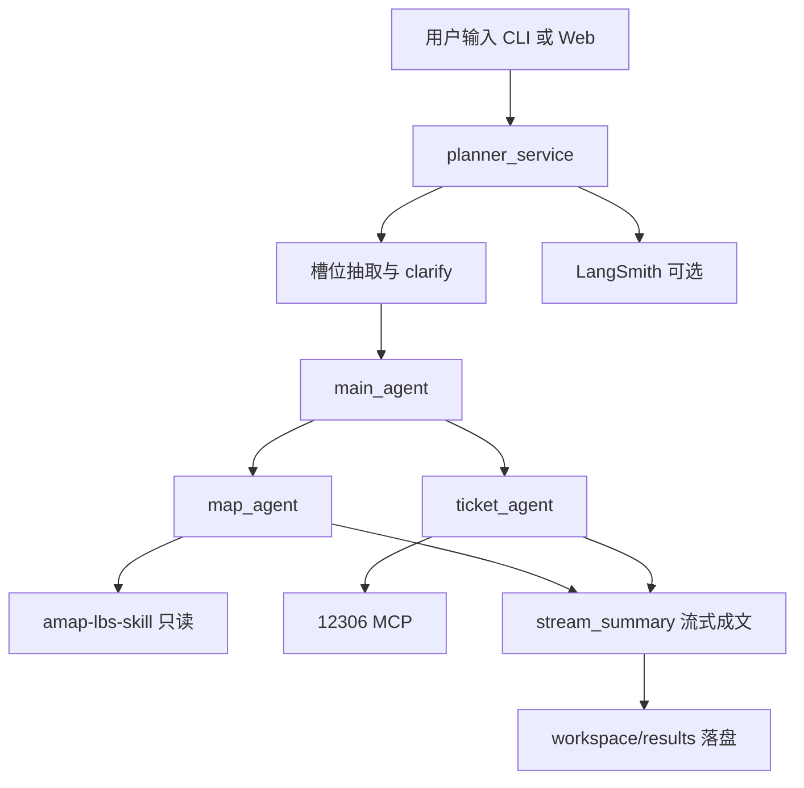

# 旅游规划多智能体

用最少工程复杂度演示 **DeepAgents + Skill + MCP + 多智能体协作**：

用户输入一句自然语言旅游需求，系统自动完成 **景点筛选 / 路线地图 / 12306 车票建议 / 最终方案汇总**。

支持两种入口，共用同一套规划核心：

| 入口 | 命令 | 说明 |
|------|------|------|
| Web | `python -m uvicorn server:app --reload --host 127.0.0.1 --port 8000` | FastAPI + Vue3，SSE 流式进度 |
| CLI | `python app.py "你的需求"` | 控制台交互，支持澄清补槽 |

---

## 功能一览

- **自然语言理解**：抽取出发地、目的地、日期、天数、预算、偏好、节奏等槽位
- **人机确认（HITL）**：出发地 / 目的地 / 日期缺失时弹出确认卡；软字段可预填默认值
- **地图子智能体**：挂载本地高德 Skill，推荐景点、规划路线、生成地图 HTML
- **车票子智能体**：经 12306 MCP 查车次与票价；不可用时降级，**禁止编造票务**
- **流式汇总**：按固定六章节输出 Markdown，前端打字机展示
- **产物落盘**：方案写入 `workspace/results/`，地图写入 `workspace/results/maps/{plan_id}.html`
- **可选 LangSmith**：过程可视化追踪

---

## 架构



| 组件 | 职责 |
|------|------|
| `main_agent` | 按已确认槽位调度 map / ticket（模型：DeepSeek `deepseek-flash`） |
| HITL | critical 槽位齐全才继续；soft 槽位可默认 |
| `map_agent` | 景点 / 路线 / 地图 |
| `ticket_agent` | 车次 / 票价；同城或明确自驾等可不查票 |
| `stream_summary` | 编排层直接流式成文（不再经 DeepAgents task） |
| 文件系统 | 智能体仅能访问 `/workspace/results`、`/workspace/config`、`/workspace/skills` |

---

## 快速开始

### 环境要求

- Python **3.11+**（推荐 Conda）
- Node.js **18+**（高德 Skill 脚本依赖）
- DeepSeek API Key、高德 Web 服务 Key

### 1. 克隆并安装 Python 依赖

```bash
git clone <你的仓库地址>
cd 旅行规划多智能体

conda create -n travel-planner python=3.11 -y
conda activate travel-planner
pip install -r requirements.txt
```

### 2. 安装高德 Skill 依赖

```bash
cd amap-lbs-skill
npm install
cd ..
```

### 3. 配置密钥

```bash
# Windows
copy .env.example .env

# macOS / Linux
cp .env.example .env
```

编辑 `.env`（**切勿提交**）：

| 服务 | 申请入口 | 环境变量 |
|------|----------|----------|
| DeepSeek | https://platform.deepseek.com/ | `OPENAI_API_KEY`、`OPENAI_BASE_URL=https://api.deepseek.com` |
| 高德 Web 服务 | https://lbs.amap.com/api/webservice/create-project-and-key | `AMAP_WEBSERVICE_KEY` |
| LangSmith（可选） | https://smith.langchain.com | `LANGSMITH_API_KEY`、`LANGSMITH_PROJECT=travel-planner` |

也可把高德 Key 写入 `amap-lbs-skill/config.json`（由 `config.example.json` 复制），该文件已被 gitignore。

12306 MCP 使用公开的 ModelScope Streamable HTTP 地址，一般无需额外 Key（见 `ticket_sub_agent.py`）。

### 4. 启动

**Web（推荐）：**

```bash
python -m uvicorn server:app --reload --host 127.0.0.1 --port 8000
```

浏览器打开：http://127.0.0.1:8000/

**CLI：**

```bash
python app.py "帮我规划下周六从杭州去苏州一日游，预算 800，想看园林和老街，尽量少折腾"
python app.py   # 交互输入
```

规划结果示例路径：

- `workspace/results/旅游规划-YYYY-MM-DD-HHMMSS.md`
- `workspace/results/maps/{plan_id}.html`（若生成了地图）

---

## SSE 事件协议

`POST /api/plan`

请求体：

```json
{
  "query": "自然语言需求",
  "slots": null
}
```

确认卡回传时带上已校验的 `slots`。响应为 `text/event-stream`，每帧：`data: {json}\n\n`。

| type | 主要字段 | 含义 |
|------|----------|------|
| `status` | `message` | 进度文案 / 抽取失败降级提示 |
| `slots` | `slots` | 抽取或已确认的槽位 |
| `clarify` | `slots`, `missing`, `defaults_applied`, `message` | 等人确认（仅 critical 缺失） |
| `step` | `id`, `status` | `understand` / `ticket` / `map` / `summary`；状态 `pending`/`active`/`done`/`skipped` |
| `subagent` | `name` | 调度的子智能体 |
| `tool` | `name`, `args` | 工具调用 |
| `tool_result` | `content` | 工具返回（已截断） |
| `model` | `content` | 主模型短状态文本 |
| `token` | `content` | summary 增量文本 |
| `final` | `content`, `saved_url`, `plan_id`, `map_url?`, `trace_url?` | 完整方案与产物链接 |
| `error` | `message` | 失败 |

其它 HTTP：

| 方法 | 路径 | 说明 |
|------|------|------|
| GET | `/` | 前端首页 |
| GET | `/api/health` | 健康检查 |
| GET | `/results/...` | 方案 / 地图静态文件 |

---

## 目录结构

```text
旅行规划多智能体/
├── planner_service.py      # 对外 API（CLI / Web / 测试入口）
├── planner/                # 规划核心拆分
│   ├── paths.py            # 路径、编码、LangSmith
│   ├── backends.py         # 虚拟文件系统（skill 只读）
│   ├── prompts.py          # 主智能体提示词
│   ├── llm.py              # 模型初始化与槽位抽取
│   ├── ticket_cache.py     # 车票 MCP TTL 缓存与三态
│   ├── async_utils.py      # 可取消异步迭代
│   ├── summary.py          # 汇总成文与落盘
│   └── pipeline.py         # stream_plan 流水线
├── slots.py                # 槽位模型与相对日期解析（纯函数）
├── app.py                  # CLI 入口
├── server.py               # FastAPI + SSE
├── frontend/               # Vue3 CDN 单页
│   ├── index.html          # 页面结构
│   ├── app.js              # SSE / 确认卡逻辑
│   └── style.css
├── map_sub_agent.py        # 地图子智能体配置
├── ticket_sub_agent.py     # 车票子智能体（MCP 懒加载）
├── summary_sub_agent.py    # 汇总提示词
├── amap-lbs-skill/         # 高德地图 Skill（Node）
├── evals/                  # 单元 / 集成评测
├── workspace/
│   ├── config/memory/      # 智能体长期记忆
│   └── results/maps/       # 运行产物（git 忽略内容）
├── requirements.txt
├── .env.example
├── .gitignore
└── README.md
```

---

## 评测

```bash
# 默认：纯函数 + mock，无网络，适合 CI
pytest evals/test_unit.py -q

# 集成：需 .env 中 DeepSeek Key
pytest -m integration evals/test_integration.py -q
```

覆盖点概要：

- critical / soft 分级与 `should_clarify`
- 相对日期换算（可注入 `today=`）
- `TravelSlots` 校验
- 方案六章节结构、禁止编造车次
- 票务三态（`unavailable` / `not_needed` / `ok`）
- `stream_plan` 并行调度与自驾跳过查票（mock）

详见 [`evals/README.md`](evals/README.md)。

---

## LangSmith（可选）

在 `.env` 中设置：

```bash
LANGSMITH_TRACING=true
LANGSMITH_API_KEY=your_langsmith_api_key
LANGSMITH_PROJECT=travel-planner
```

未配置 Key 时 tracing 关闭，规划照常运行。配置后可在 https://smith.langchain.com 查看嵌套 trace；Web 结果区也会出现追踪链接（能生成 URL 时）。

---

## 设计要点与降级策略

1. **车票不可用**：MCP 超时或失败 → 跳过 `ticket_agent`，方案中如实说明，不编造车次
2. **无需铁路**：同城游 / 明确自驾地铁等 → `ticket` 步骤 `skipped`，文案为「未查票（无需铁路）」
3. **槽位抽取失败**：退回 legacy 提示词，仍尽量完成规划
4. **客户端断开**：Web SSE 通过 `cancel_event` 尽快停止后续 LLM 调用，节省费用
5. **Skill 只读**：高德目录经 `ReadOnlyBackend` 挂载，防止智能体改写脚本

---

## 安全说明

- 本仓库**不包含**真实 API Key
- 请用 `.env.example` 复制为本地 `.env`，且确保 `.env`、`amap-lbs-skill/config.json` 已被忽略
- 前端不持有任何密钥；密钥仅存在于服务端环境变量
- 提交 GitHub 前请执行 `git status`，确认没有误加密钥文件

---

## 常见问题

**Q: `uvicorn` 命令找不到？**  
用 `python -m uvicorn ...`，避免 Conda 环境 PATH 未生效。

**Q: 只有景点没有车票？**  
检查网络与 ModelScope MCP 是否可达；服务不可用时会自动降级。

**Q: 地图空白？**  
确认 `AMAP_WEBSERVICE_KEY` 有效，且 Skill 目录已 `npm install`。

**Q: Windows 中文乱码？**  
项目启动时会尽量将 stdout/stderr 设为 UTF-8；请使用 UTF-8 终端。

---

## License

项目主体代码按仓库约定使用；`amap-lbs-skill/` 内另有其自身 LICENSE，请一并遵守。
